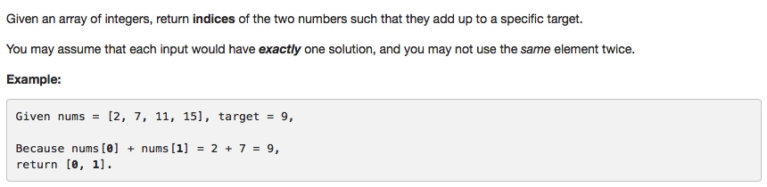

# 001 Two Sum

- **Array**
- **Hash Table** + two pointers


## Description



## 1. Thought Line
(1) map struture **mapHash** is for storing the occurrence numbers of each number.


## 2. Hash Table + Two Pointers

```c
class Solution {
public:
    vector<int> twoSum(vector<int>& nums, int target) {
        vector<int> result;
        map<int,int> mapHash;
        if (nums.size()<2) return result;
        
        for (vector<int>::size_type i=0; i<=nums.size()-1; ++i)
            ++mapHash[nums[i]];
        
        for (vector<int>::size_type i=0; i<=nums.size()-2; ++i){
            int currentValue = nums[i];
            int biasValue = target-nums[i];

            // cannot use the same element twice.
            --mapHash[currentValue]; 
            if (mapHash[biasValue]>0){
                for (vector<int>::size_type j=i+1; j<=nums.size()-1; ++j){
                    if (nums[j]==biasValue){
                        result.push_back(i);
                        result.push_back(j);
                        return result;
                    }
                }
            }
        }
        return result;
    }
};
```

