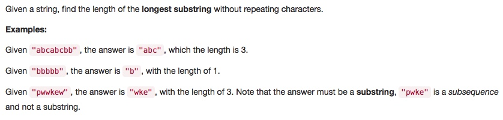

# 003 Longest Substring Without Repeating Characters

-  **Array**+**Hash Table**+**String**

## Description



## 1. Thought Line
### (1) Bit manipulation for duplicate elements.


## 2. Hash Table + String

```c
class Solution {
public:
    int lengthOfLongestSubstring(string s) {
        int res = 0;
        set<char> setHash;
        int loopStart = 0;

        for (int i=0; !s.empty()&&i<=s.size()-1; ++i){
            char chr = s[i];
            if (setHash.find(chr) == setHash.end())
                setHash.insert(chr);
            else{
                // calculate the none duplicate number in this term.
                res = (setHash.size()>res)?setHash.size():res;
                
                // find out the index of which one leaded to this 
                // duplication issue.
                for (int duplicateSpt = loopStart; duplicateSpt<=i-1; 	
                     ++duplicateSpt)
                {
                    setHash.erase(s[duplicateSpt]);
                    if (s[duplicateSpt]==chr){
                        i = i-1;
                        loopStart = duplicateSpt+1;
                        break;
                    }
                }
            }
            
        }
        res = (s.size()-loopStart>res)?s.size()-loopStart:res;
        return res;
    }
};
```

