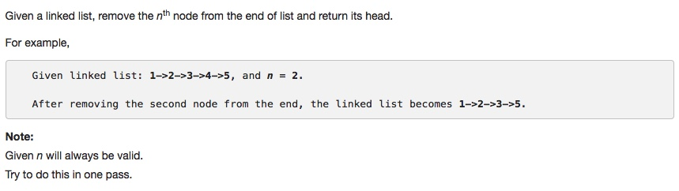

# 019 Remove Nth Node From End of List

- **Linked List**+**Two Pointers**

## Description


## 1. Thought Line


## 2. **Linked List**+**Two Pointers**

```c
/**
 * Definition for singly-linked list.
 * struct ListNode {
 *     int val;
 *     ListNode *next;
 *     ListNode(int x) : val(x), next(NULL) {}
 * };
 */
class Solution {
public:
    ListNode* removeNthFromEnd(ListNode* head, int n) {
        int sizeList = 0;
        
        // calculate the total size of list
        ListNode* node = head;
        while(node!=nullptr){
            ++sizeList;
            node = node->next;
        }
        if(n<1 || n>sizeList) return head;
        
        // find the node at N+1 from end (sizeList - N from head)
        ListNode* dummyHead = new ListNode(0);
        dummyHead->next = head;
        int count = 0;
        ListNode* findTheNodeBeforeDeleteNode = dummyHead;
        ListNode* findTheNodeOfDeleteNode = head;
        while(count<sizeList - n){
            findTheNodeBeforeDeleteNode = findTheNodeBeforeDeleteNode->next;
            findTheNodeOfDeleteNode = findTheNodeOfDeleteNode->next;
            ++count;
        }
        findTheNodeBeforeDeleteNode->next = findTheNodeOfDeleteNode->next;
        findTheNodeOfDeleteNode->next = nullptr;
        return dummyHead->next;
    }
};
```

