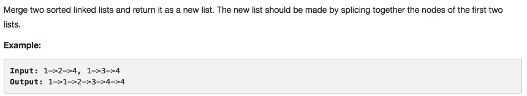

# 021 Merge Two Sorted Lists

- **Linked List**
- 
## Description


## 1. Thought line

## 2. Linked List

```c
/**
 * Definition for singly-linked list.
 * struct ListNode {
 *     int val;
 *     ListNode *next;
 *     ListNode(int x) : val(x), next(NULL) {}
 * };
 */
class Solution {
public:
    ListNode* mergeTwoLists(ListNode* l1, ListNode* l2) {
        
        ListNode* dummyHead = new ListNode(0);
        ListNode* ptr = dummyHead;
        
        while (l1 != nullptr || l2 !=nullptr){
            if (l1==nullptr) {
                ptr->next = l2;
                break;
            }
            if (l2==nullptr) {
                ptr->next = l1;
                break;
            }
            int v1 = l1->val, v2 = l2->val;
            ptr->next = (v1<=v2)?new ListNode(v1):new ListNode(v2);
            l1 = (v1<=v2)?l1->next:l1;
            l2 = (v1>v2)?l2->next:l2;
            ptr = ptr->next;
            
        }
        return dummyHead->next;
    }
};
```

