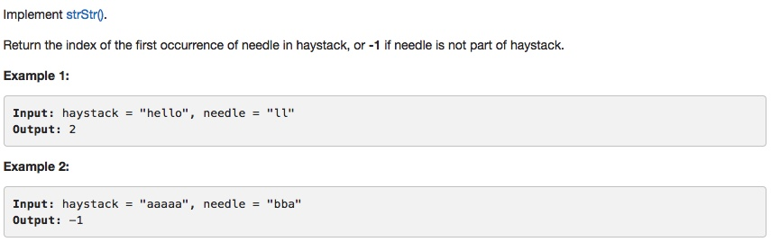

# 027 Remove Element
- **Two pointers**+array

## Description

## 1. Thought line
1. if haystack is empty, return -1;
2. if needle is empty, return 0;

## 2. **Two pointers**+string

```c
class Solution {
public:
    int strStr(string haystack, string needle) {
        if (needle.empty()) return 0;
        if (haystack.empty()) return -1;

        int n = haystack.size(), m = needle.size();
        for (int i = 0; i<=n-m; ++i){
            if (haystack[i] == needle[0]){
                bool find = true;
                for (int j = 0; find && j<=m-1; ++j){
                    if (haystack[i+j]!=needle[j]) find = false;
                }
                if (find) return i;
            }
        }
        return -1;
    }
};
```

