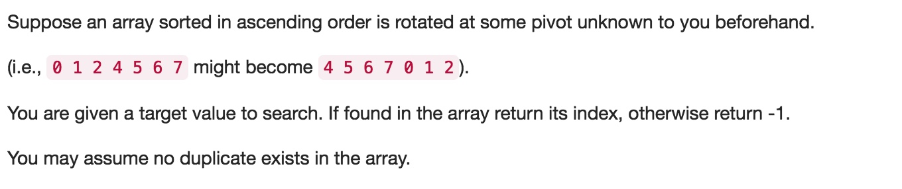

# 033 Search in Rotated Sorted Array
- **Binary Search**+array

## Description


## 1. Thought line

1. Find pivot
2. Do binary search on left half;
3. Do binary search on right half;
4. Binary search processing

   


## 2. **Binary Search**+array

```c
class Solution {

private:
    void binarySearch(vector<int>& nums, int target, int st, int ed, int& res){
        // finish process condition
        if (st>ed) return;
        if (target<nums[st]||target>nums[ed]) return;
        
        // no target
        if (st==ed && nums[st]!=target) return;
        
        // find target
        if (st==ed && nums[st]==target) res = st;
        
        // keep finding process
        else{
            // middle spot in array
            int mid = (st+ed)/2;
            if (target<=nums[mid])
                binarySearch(nums, target, st, mid, res);
            else
                binarySearch(nums, target, mid+1, ed, res);
        }
    }

public:
    int search(vector<int>& nums, int target) {
        int res = -1;
        int pivot = 0;
        if (nums.empty()) return -1;
        // find pivot
        for (int i = 1; !nums.empty() && i<=nums.size()-1; ++i){
            if (nums[i-1]>nums[i]){
                pivot = i;
                break;
            }
        }
        // process binary search on left half 
        binarySearch(nums, target, 0, pivot-1, res);
        // process binary search on right half
        binarySearch(nums, target, pivot, nums.size()-1, res);
        return res;
    }
};
```

