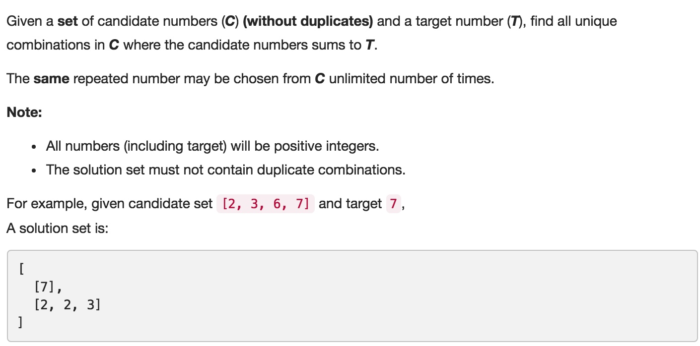

# 039 Combination Sum
- **BackTracking**+array

## Description


## 1. Thought line


## 2. **BackTracking**+array

```c
class Solution {
private:
    void backTrackingSum(vector<int>& nums, int target, int sum, int st, vector<vector<int>>& result, vector<int>& temp){
        if (sum == target) {
            result.push_back(temp);
            return;
        }
        if (st>=nums.size() || sum > target || sum+nums[st]>target) return;
        for (int i = st; i<=nums.size()-1; ++i){
            temp.push_back(nums[i]);
            backTrackingSum(nums, target, sum+nums[i], i, result, temp);
            temp.pop_back();
            while(i+1<=nums.size()-1&&nums[i+1]==nums[i]) ++i;
        }
    }

public:
    vector<vector<int>> combinationSum(vector<int>& candidates, int target) {
        vector<vector<int>> result;
        vector<int> temp;
        sort(candidates.begin(),candidates.end());
        backTrackingSum(candidates, target, 0, 0, result, temp);
        return result;
    }
};
```

