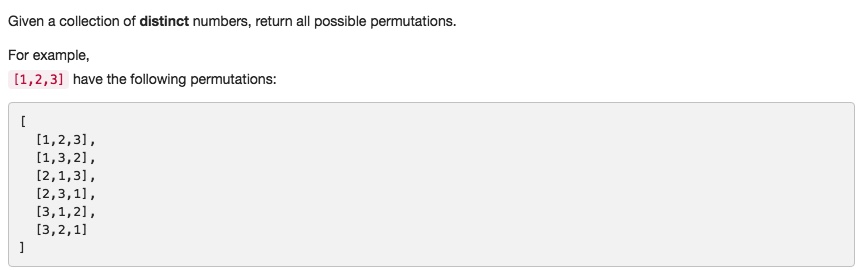

# 046 Permutations
- **BackTracking**+array

## Description


## 1. Thought line


## 2. **BackTracking**+array

```c
class Solution {
private:
    void backTracking_fct(vector<vector<int>>& result, vector<int>& nums, vector<bool>& flag, 
                     vector<int>& temp){
        if (temp.size()==nums.size()){
            result.push_back(temp);
            return;
        }
        
        for (int i = 0; i<=flag.size()-1; ++i){
            if (!flag[i]){
                temp.push_back(nums[i]);
                flag[i] = true;
                backTracking_fct(result, nums, flag, temp);
                flag[i] = false;
                temp.pop_back();
            }
        }
    }
    
    
public:
    vector<vector<int>> permute(vector<int>& nums) {
        vector<vector<int>> result;
        vector<bool> flag(nums.size(),false);
        vector<int> temp;
        backTracking_fct(result, nums, flag, temp);
        return result;
    }
};
```

