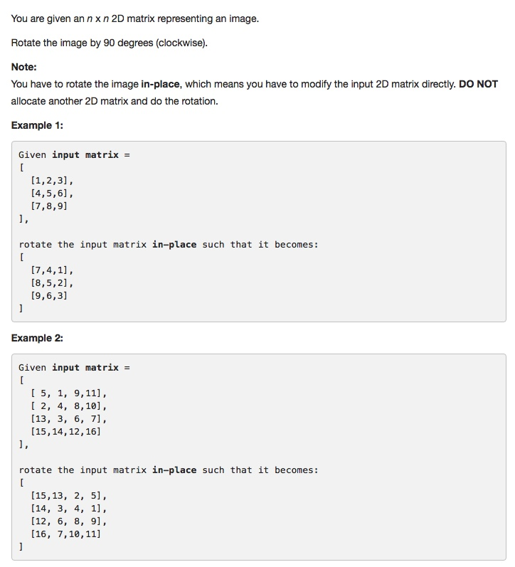
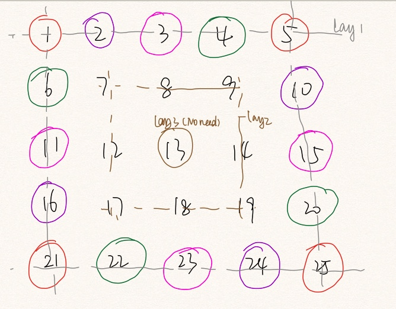

# 048 Rotate Image
- array
- **Onion-rotate**

## Description


## 1. Thought line



## 2. **Onion-rotate**

```c
class Solution {
public:
    void rotate(vector<vector<int> > &matrix) {
        int start = 0, end = matrix.size()-1;
        while(start<end) {
            for(int i=start; i<end; i++) {  // rotate a layer
                int offset = i - start;
                int temp = matrix[start][i];
                matrix[start][i] = matrix[end-offset][start];
                matrix[end-offset][start] = matrix[end][end-offset];
                matrix[end][end-offset] = matrix[start+offset][end];
                matrix[start+offset][end] = temp;
            }
            start++;
            end--;
        }
    }
};
```

