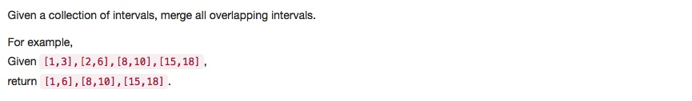

# 056 Merge Intervals
- **Sort**+array

## Description


## 1. Thought line


## 2. **Greedy**+array

```c
/**
 * Definition for an interval.
 * struct Interval {
 *     int start;
 *     int end;
 *     Interval() : start(0), end(0) {}
 *     Interval(int s, int e) : start(s), end(e) {}
 * };
 */
class Solution {
public:
    vector<Interval> merge(vector<Interval>& intervals) {
        vector<Interval> result;
        
        sort(intervals.begin(), intervals.end(), [](const Interval & a, const Interval & b){ 
            return a.start < b.start; 
        });
        
        for (int i=0; !intervals.empty()&&i<=intervals.size()-1; ++i){
            Interval temp = intervals[i];
            while (i+1<=intervals.size()-1 && intervals[i+1].start<=temp.end){
                temp.end = temp.end>intervals[i+1].end?temp.end:intervals[i+1].end;
                ++i;
            }
            result.push_back(temp);
        }
        return result;
    }
};
```

