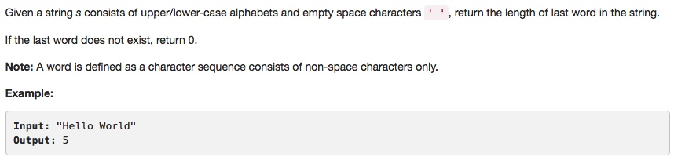

# 056 Merge Intervals
- String

## Description


## 1. Thought line

## 2. String

```c
class Solution {
public:
    int lengthOfLastWord(string s) {
        int result = 0;
        bool flag = false; //for detect the end edge of last word
        int n = s.size()-1;
        while(n>=0){
            if (flag && s[n] == ' ') break;
            else if (s[n]!= ' '){
                ++result;
                flag = true;
            }
            --n;
        }
        return result;
    }
};
```

