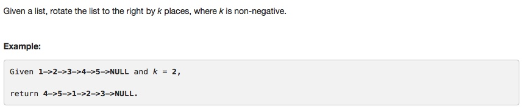

# 061 Rotate List
- **Two pointers**+Linked List

## Description


## 1. Thought line


## 2. **Two pointers**+Linked List

```c
/**
 * Definition for singly-linked list.
 * struct ListNode {
 *     int val;
 *     ListNode *next;
 *     ListNode(int x) : val(x), next(NULL) {}
 * };
 */
class Solution {
public:
    ListNode* rotateRight(ListNode* head, int k) {
        if (head==nullptr || head->next==nullptr) return head;
        
        // Find the size of list: N
        int N = 0;
        ListNode* dummyHead = new ListNode(0);
        dummyHead->next = head;
        ListNode* ptrTemp = dummyHead->next;
        ListNode* listTail = dummyHead->next;
        while(ptrTemp!=nullptr){
            ++N;
            if (ptrTemp->next == nullptr)
                listTail = ptrTemp;
            ptrTemp = ptrTemp->next;
        }
        
        // Get real k 
        if (k>N) k = k%N;
        if (k==0) return head;
        
        // Get the new head and the new tail
        int count = 0;
        ListNode* newTail = dummyHead;
        while(newTail!=nullptr && count<N-k){
             newTail = newTail->next;
            ++count;
        }
        
        ListNode* newHead = newTail->next;
        
        // shape the list
        newTail->next = nullptr;
        listTail->next = dummyHead->next;
        dummyHead->next = newHead;
        return newHead;
    
    }
};
```

