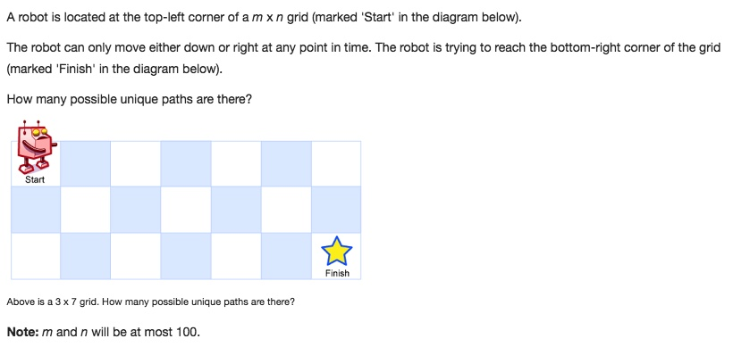

# 062 Unique Paths
- **Dynamic Programming**+Array

## Description


## 1. Thought line


## 2. **Dynamic Programming**+Array

```c
class Solution {
public:
    int uniquePaths(int m, int n) {
        int Possibility [m][n];
        
        // initiate Possibility array
        for (int i=0; i<=m-1; ++i)
            for (int j=0; j<=n-1; ++j)
                if (i==0 || j==0)
                    Possibility[i][j]=1;
        
        // dp
        for (int i=1; i<=m-1; ++i){
            for (int j=1; j<=n-1; ++j)
                Possibility[i][j] = Possibility[i-1][j]+Possibility[i][j-1];
            
        }
        return Possibility[m-1][n-1];
    }
};
```

