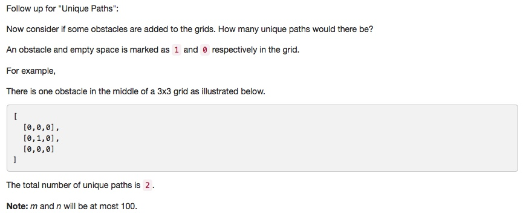

# 063 Unique Paths II
- **Dynamic Programming**+Array

## Description


## 1. Thought line


## 2. **Dynamic Programming**+Array

```c
class Solution {
public:
    int uniquePathsWithObstacles(vector<vector<int>>& obstacleGrid) {
        if (obstacleGrid.empty()) return 0;
        int m = obstacleGrid.size(), n = obstacleGrid[0].size();
        int Possibility [m][n] = {0};
        
        // initiate Possibility array
        bool flagi = false, flagj = false;
        for (int i= 0; i<=m-1; ++i){
            if (obstacleGrid[i][0]==1 || flagi){
                flagi = true;
                Possibility[i][0] = 0;
            }
            else if(!flagi)
                Possibility[i][0] = 1;
        }
       
        for (int j= 0; j<=n-1; ++j){
            if (obstacleGrid[0][j]==1 || flagj){
                flagj = true;
                Possibility[0][j] = 0;
            }
            else if (!flagj)
                Possibility[0][j] = 1;
        }
        
        // dp
        for (int i=1; i<=m-1; ++i){
            for (int j=1; j<=n-1; ++j){
                if (obstacleGrid[i][j]!=1)
                    Possibility[i][j] = Possibility[i-1][j]+Possibility[i][j-1];
            }
            
        }
        return Possibility[m-1][n-1];
        
    }
};
```

