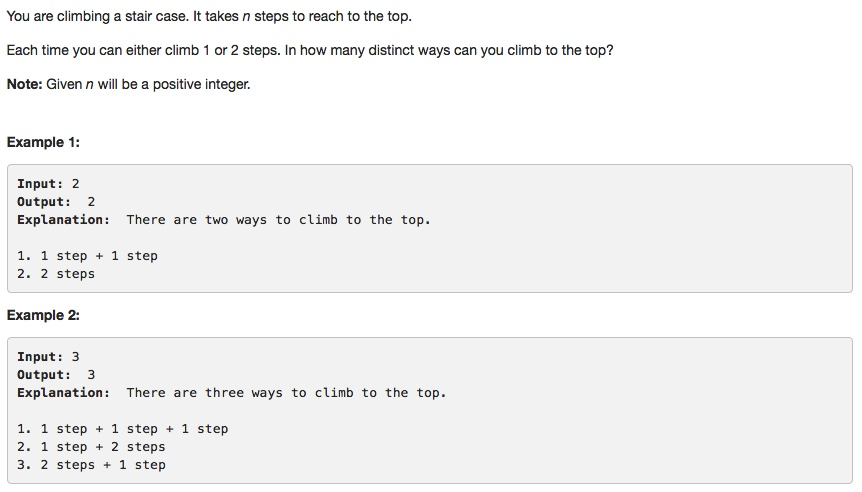

# 070 Climbing Stairs
- **Dynamic Programming**

## Description


## 1. Thought line


## 2. **Dynamic Programming**

```c
class Solution {
public:
    int climbStairs(int n) {
        // f[n] = f[n-1] + f[n-2]
        vector<int> ladder(n+1);
        ladder[1] = 1, ladder[2] = 2;
        for (int i = 3; i<=n; ++i){
            ladder[i] = ladder[i-1] + ladder[i-2];
        }
        return ladder[n];
    }
};
```

