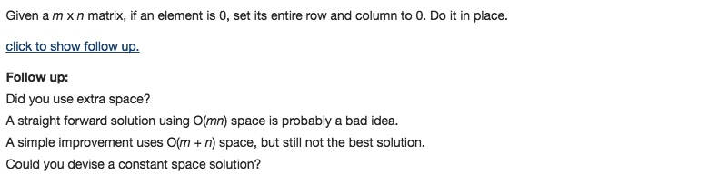

# 073 Set Matrix Zeroes
- array

## Description


## 1. Thought line


## 2. **Hash Table**+array

```c
class Solution {
public:
    void setZeroes(vector<vector<int>>& matrix) {
        set<int> zeroRow, zeroCol;
        if (matrix.empty()) return;
        for (int i = 0; i<=matrix.size()-1; ++i)
            for (int j = 0; j<=matrix[i].size()-1; ++j)
                if (matrix[i][j]==0){
                    zeroRow.insert(i), zeroCol.insert(j);
                }    
        for (int i=0; i<=matrix.size()-1; ++i)
            for (int j = 0; j<=matrix[i].size()-1; ++j)
                if (zeroRow.find(i)!=zeroRow.end() || zeroCol.find(j)!=zeroCol.end())
                    matrix[i][j]=0;
    }
};
```

