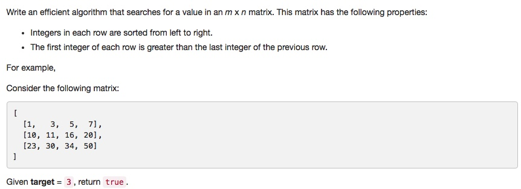

# 074 Search a 2D Matrix
- **Binary Search**+array

## Description


## 1. Thought line


## 2. **Binary Search**+array

```c
class Solution {
private:
    void binarySearchMatrix(vector<vector<int>>& matrix, int st, int ed, int target, bool& res){
        if (matrix.empty()||st>ed||res) return;
        
        if (st==ed){
            // corner case
            for (int i = 0; !matrix[st].empty()&&i<=matrix[st].size()-1; ++i)
                if (matrix[st][i]==target) 
                    res = true;
            return;
        }
        int midRow = (st+ed)/2, n = matrix[midRow].size()-1;
        if (target>matrix[midRow][n])
            binarySearchMatrix(matrix, midRow+1, ed, target, res);
        else
            binarySearchMatrix(matrix, st, midRow, target, res);

    }
public:
    bool searchMatrix(vector<vector<int>>& matrix, int target) {
        bool res = false;
        binarySearchMatrix(matrix, 0, matrix.size()-1, target, res);
        return res;
    }
};
```

