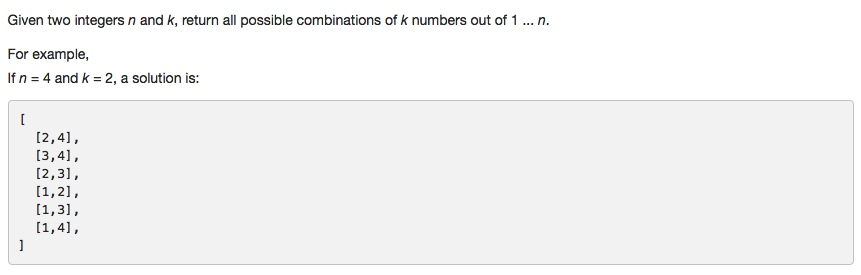

# 077 Combinations
- **Backtracking**

## Description


## 1. Thought line


## 2. **Backtracking**

```c
class Solution {
private:
    void backTrackingCombine(int st, int& ed, int& k, vector<int>& temp, vector<vector<int>>& result){
        if (temp.size()==k){
            result.push_back(temp);
            return;
        }
        if (st>ed || temp.size()>k) return;
        
        for (int i = st; i<=ed; ++i){
            temp.push_back(i);
            backTrackingCombine(i+1, ed, k, temp, result);
            temp.pop_back();
        }
        
    }
public:
    vector<vector<int>> combine(int n, int k) {
        vector<vector<int>> result(0);
        vector<int> temp(0);
        backTrackingCombine(1, n, k, temp, result);
        return result;
    }
};
```

