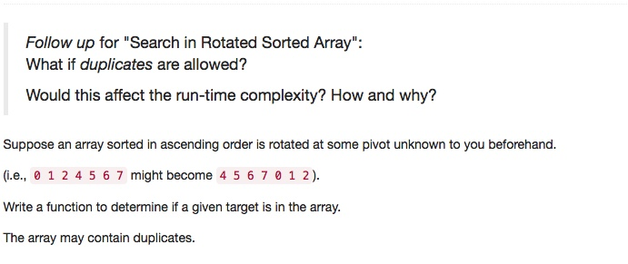

# 081 Search in Rotated Sorted Array II
- **Binary Search**+Array

## Description


## 1. Thought line


## 2. **Binary Search**+Array

```c
class Solution {
private:
    void binarySearch(vector<int>& nums, int target, int st, int ed, bool& res){
        // finish process condition
        if (st>ed) return;
        if (target<nums[st]||target>nums[ed]) return;
        
        // no target
        if (st==ed && nums[st]!=target) return;
        
        // find target
        if (st==ed && nums[st]==target) res = true;
        
        // keep finding process
        else{
            int midSt = (st+ed)/2, midEd = (st+ed)/2;
             if (nums[midSt]==target) {
                 res = true;
                 return;
             }
            // find the bottle and top elements as same value of nums[mid];
            while (midSt-1>=0 && nums[midSt]==nums[midSt-1])
                --midSt;
            while (midEd + 1<=nums.size()-1 && nums[midEd]==nums[midEd+1])
                ++midEd;
            if (target<nums[midSt])
                binarySearch(nums, target, st, midSt-1, res);
            else
                binarySearch(nums, target, midEd+1, ed, res);
        }
    }
    
public:
    bool search(vector<int>& nums, int target) {
        bool res = false;
        int pivot =0;
        if (nums.empty()) return false;
        // find pivot
        for (int i = 1; !nums.empty() && i<=nums.size()-1; ++i){
            if (nums[i-1]>nums[i]){
                pivot = i;
                break;
            }
        }
        // process binary search on left half 
        binarySearch(nums, target, 0, pivot-1, res);
        // process binary search on right half
        binarySearch(nums, target, pivot, nums.size()-1, res);
        return res;
    }
};
```

