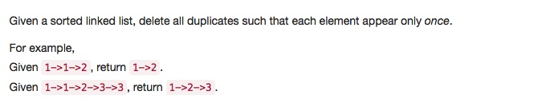

# 083 Remove Duplicates from Sorted List
- **Linked List**

## Description


## 1. Thought line


## 2. **Linked List**

```c
/**
 * Definition for singly-linked list.
 * struct ListNode {
 *     int val;
 *     ListNode *next;
 *     ListNode(int x) : val(x), next(NULL) {}
 * };
 */
class Solution {
public:
    ListNode* deleteDuplicates(ListNode* head) {
        ListNode* dummyHead = new ListNode(0);
        dummyHead->next = head;
        ListNode* validatedPtr = dummyHead;

        while(head!=nullptr){
            while(head->next!=nullptr && head->next->val == head->val)
                head = head->next;
            validatedPtr->next = head;
            validatedPtr = validatedPtr->next;
            head = head->next;
        }
        validatedPtr->next = nullptr;
        return dummyHead->next;
    }
};
```

