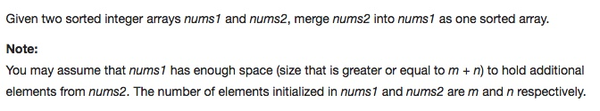

# 088 Merge Sorted Array
- **Two Pointers** + Array

## Description


## 1. Thought line


## 2. **Two Pointers** + Array

```c
class Solution {
public:
    void merge(int A[], int m, int B[], int n) {
        
        int a=m-1;
        int b=n-1;
        int i=m+n-1;    // calculate the index of the last element of the merged array
        
        // go from the back by A and B and compare and put to the A element which is larger
        while(a>=0 && b>=0){
            if(A[a]>B[b])   A[i--]=A[a--];
            else            A[i--]=B[b--];
        }
        
        // if B is longer than A just copy the rest of B to A location, otherwise no need to do anything
        while(b>=0)         A[i--]=B[b--];
    }
};
```

