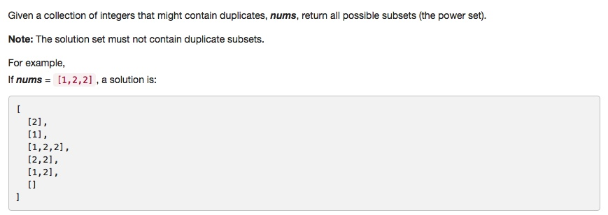

# 090 Subsets II
- **Backtracking** + Array

## Description


## 1. Thought line


## 2. **Backtracking** + Array

```c
class Solution {
private:
    void backtrackingSubsets(vector<int>& nums, int st, vector<vector<int>>& result, vector<int>& temp){
        if (st>nums.size()-1) return;
        for (int i = st; i<=nums.size()-1; ++i){
            temp.push_back(nums[i]);
            result.push_back(temp);
            backtrackingSubsets(nums, i+1, result, temp);
            temp.pop_back();
            while(i+1<=nums.size()-1 && nums[i+1] == nums[i])
                ++i;
        }
        
    }
public:
    vector<vector<int>> subsetsWithDup(vector<int>& nums) {
        vector<vector<int>> result = {{}};
        vector<int> temp;
        sort(nums.begin(), nums.end());
        backtrackingSubsets(nums, 0, result, temp);
        return result;
    }
};
```

