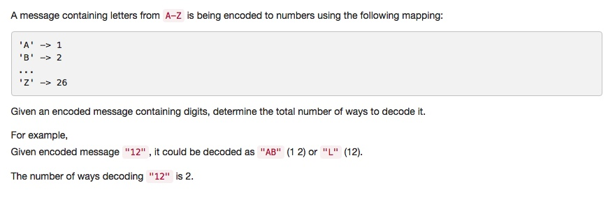

# 091 Decode Ways
- **Dynamic Programming** + String

## Description


## 1. Thought line
(1) corner cases at res[0], res[1], res[2];
- res[0] is always 0;
- res[1] is 0 or 1;
- res[2] is 0, 1, or 2;

## 2. **Dynamic Programming** + String

```c
class Solution {
public:
    int numDecodings(string s) {
        vector<int> res(s.size()+1,0);
        res[0] = 0;
        res[1] = (s[0]=='0') ? 0 : 1;
        for (int i = 1; !s.empty()&&i<=s.size()-1; ++i){
            // detect if can move from 1 steps away
            if (s[i]!='0') 
                res[i+1] += res[i];
            // detect if can move from 2 steps away
            if (s[i-1]=='1' || (s[i-1]=='2' && s[i]<='6'))
                res[i+1] = (i>1) ? res[i+1]+res[i-1] : res[i+1]+1;
            
            if (res[i+1]==0)
                break;
        }
        return res[s.size()];
    }
};
```

