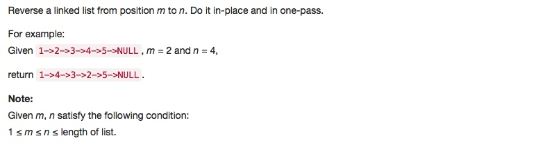

# 092 Reverse Linked List II
- Linked List

## Description


## 1. Thought line


## 2. Linked List

```c
/**
 * Definition for singly-linked list.
 * struct ListNode {
 *     int val;
 *     ListNode *next;
 *     ListNode(int x) : val(x), next(NULL) {}
 * };
 */
class Solution {
public:
    ListNode* reverseBetween(ListNode* head, int m, int n) {
        ListNode* dummyHead = new ListNode(0);
        dummyHead->next = head;
        unsigned int size = 0; 
        ListNode* ptr = dummyHead->next;
        ListNode* ptr_st = dummyHead;
        ListNode* ptr_ed = dummyHead->next;
        
        while(ptr!=nullptr){
            ++size;
            ListNode* ptr_next = ptr->next;
            if(size<=m){
                ptr_st = (size<m)?ptr_st->next:ptr_st;
                ptr_ed = (size<m)?ptr_ed->next:ptr_ed;
            } 
            else if (size>m && size<=n){
                ListNode* ptr_st_next = ptr_st->next;
                ptr_st->next = new ListNode(ptr->val);
                ptr_st->next->next = ptr_st_next;
                ptr_ed->next = ptr->next; 
            }else 
                break;
            ptr = ptr_next;
            
        }
        return dummyHead->next;
    }
};
```

