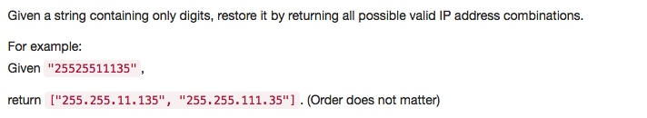

# 093 Restore IP Addresses
- **Backtracking**+string

## Description


## 1. Thought line
1. IP Address Format
2. 

## 2. **Backtracking**+string

```c
class Solution {
public:
    vector<string> restoreIpAddresses(string s) {
        vector<string> ipComb;
        vector<string> ipNum;
        findIPAddr(s, 0, ipNum, ipComb);
        return ipComb;
    }
    
    void findIPAddr(string &s, int index, vector<string> &ipNum, vector<string> &ipComb) {
        if(ipNum.size()==4) {
            if(index==s.size()) {
                string ipAddr = ipNum[0];
                for(int i=1; i<4; i++) 
                    ipAddr += ("."+ipNum[i]);
                ipComb.push_back(ipAddr);
            }
            return;
        }
        
        string curNum;
        for(int i=index; i<s.size() && i<index+3; i++) {
            curNum.push_back(s[i]);
            if(isValidNum(curNum)) {
                ipNum.push_back(curNum);
                findIPAddr(s, i+1, ipNum, ipComb);
                ipNum.pop_back();
            }
        }
    }
    
    bool isValidNum(string s) {
        if(s.empty() || s.size()>3) return false;
        if(s[0]=='0' && s.size()!=1) return false;
        if(s.size()==3 && stoi(s)>255) return false;
        return true;
    }
};
```

