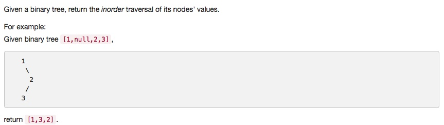
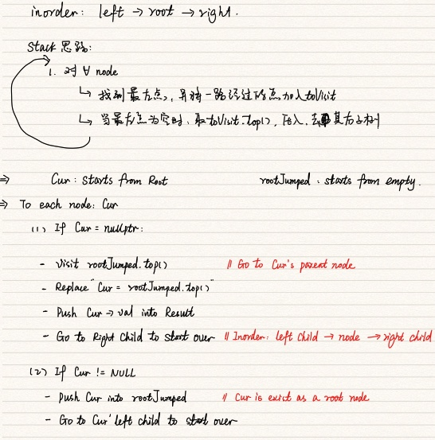

# 094 Binary Tree Inorder Traversal
- **Hash Table** + tree
- **Stack** + tree

## Description


## 1. Thought line

### (1) Stack



## 2. **Stack**+tree

```c
/**
 * Definition for a binary tree node.
 * struct TreeNode {
 *     int val;
 *     TreeNode *left;
 *     TreeNode *right;
 *     TreeNode(int x) : val(x), left(NULL), right(NULL) {}
 * };
 */
class Solution {
public:
    vector<int> inorderTraversal(TreeNode* root) {
        stack<TreeNode*> rootJumped;
        vector<int> result;
        TreeNode* cur = root;
        while(cur || !rootJumped.empty()){
            if (cur){
                rootJumped.push(cur);
                cur = cur->left;
            }
            else{
                cur = rootJumped.top();
                rootJumped.pop();
                result.push_back(cur->val);
                cur = cur->right;
                
            }
        }
        return result;
    }
};
```

