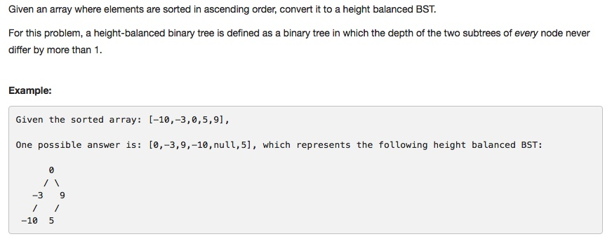

# 108 Convert Sorted Array to Binary Search Tree
- **Depth-first Search** + Tree

## Description


## 1. Thought line
- Height-balanced BST

## 2. **Depth-first Search** + Tree

```c
/**
 * Definition for a binary tree node.
 * struct TreeNode {
 *     int val;
 *     TreeNode *left;
 *     TreeNode *right;
 *     TreeNode(int x) : val(x), left(NULL), right(NULL) {}
 * };
 */
void arrayRootFind(vector<int>& nums, int st, int ed, TreeNode* node, string str = "toRightChild"){
    if (st>ed) return;
    
    int mid = (st+ed)/2;
    
    if (str == "toRightChild"){
        node->right = new TreeNode(nums[(st+ed)/2]);
        arrayRootFind(nums, st, mid-1, node->right, "toLeftChild");
        arrayRootFind(nums, mid+1, ed, node->right, "toRightChild");
    }
    else if (str == "toLeftChild"){
        node->left = new TreeNode(nums[(st+ed)/2]);
        arrayRootFind(nums, st, mid-1, node->left, "toLeftChild");
        arrayRootFind(nums, mid+1, ed, node->left, "toRightChild");
    }
}

class Solution {
public:
    TreeNode* sortedArrayToBST(vector<int>& nums) {
        if (nums.empty()) return nullptr;
        TreeNode* dummyHead = new TreeNode(INT_MIN);
        arrayRootFind(nums, 0, nums.size()-1, dummyHead);
        return dummyHead->right;
    }
};
```