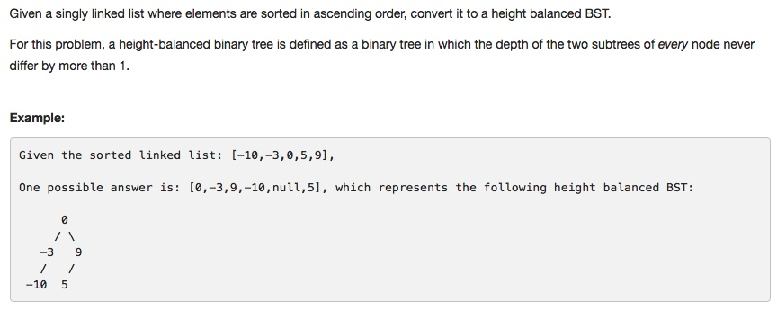

# 109 Convert Sorted List to Binary Search Tree
- **Depth-first Search** + Linked list

## Description


## 1. Thought line
- Height-balanced BST
- Find the middle node in Linked List

```c
//find the middle node of linked list
ListNode* dummyHeadLinkList = new ListNode(0);
dummyHeadLinkList->next = nodeList;
ListNode* ptr0 = dummyHeadLinkList;
ListNode* ptr1 = dummyHeadLinkList->next;  //mid spot
ListNode* ptr2 = dummyHeadLinkList->next->next;

while(ptr2 != nullptr && ptr2->next !=nullptr){
   ptr1 = ptr1->next;
   ptr2 = ptr2->next->next;
   ptr0 = ptr0->next;
}  
```

- Get left half list and right half list.

```c
// first half
ptr0->next = nullptr;
ListNode* firstHalf = dummyHeadLinkList->next;

// second half
ListNode* secondHalf = ptr1->next;
ptr1->next = nullptr;
```

## 2. **Depth-first Search** + Linked list

```c
/**
 * Definition for singly-linked list.
 * struct ListNode {
 *     int val;
 *     ListNode *next;
 *     ListNode(int x) : val(x), next(NULL) {}
 * };
 */
/**
 * Definition for a binary tree node.
 * struct TreeNode {
 *     int val;
 *     TreeNode *left;
 *     TreeNode *right;
 *     TreeNode(int x) : val(x), left(NULL), right(NULL) {}
 * };
 */
void linkedListRoodFind(ListNode* nodeList, TreeNode* nodeTree, string str = "toRightChild"){
        if (nodeList == nullptr) return;

        //find the middle node of linked list
        ListNode* dummyHeadLinkList = new ListNode(0);
        dummyHeadLinkList->next = nodeList;
        ListNode* ptr0 = dummyHeadLinkList;
        ListNode* ptr1 = dummyHeadLinkList->next;  //mid spot
        ListNode* ptr2 = dummyHeadLinkList->next->next;

        while(ptr2 != nullptr && ptr2->next !=nullptr){
            ptr1 = ptr1->next;
            ptr2 = ptr2->next->next;
            ptr0 = ptr0->next;
        }        
        
        // first half
        ptr0->next = nullptr;
        ListNode* firstHalf = dummyHeadLinkList->next;

        // second half
        ListNode* secondHalf = ptr1->next;
        ptr1->next = nullptr;

        if (str == "toRightChild"){
            nodeTree->right = new TreeNode(ptr1->val);
            linkedListRoodFind(firstHalf, nodeTree->right, "toLeftChild");
            linkedListRoodFind(secondHalf, nodeTree->right, "toRightChild");
        }
        else if (str == "toLeftChild"){
            nodeTree->left = new TreeNode(ptr1->val);
            linkedListRoodFind(firstHalf, nodeTree->left, "toLeftChild");
            linkedListRoodFind(secondHalf, nodeTree->left, "toRightChild");
        }

    }
    
class Solution {
public:
    TreeNode* sortedListToBST(ListNode* head) {
        if (head==nullptr) return nullptr;
        TreeNode* dummyHead = new TreeNode(INT_MIN);
        linkedListRoodFind(head,dummyHead);
        return dummyHead->right;
    }
};
```