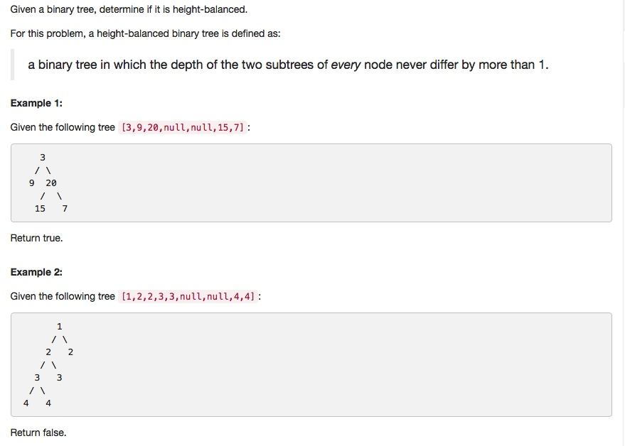

# 110 Balanced Binary Tree
- **Depth-first Search** + Tree

## Description


## 1. Thought line
- Height-balanced BST

## 2. **Depth-first Search** + Tree

```c
/**
 * Definition for a binary tree node.
 * struct TreeNode {
 *     int val;
 *     TreeNode *left;
 *     TreeNode *right;
 *     TreeNode(int x) : val(x), left(NULL), right(NULL) {}
 * };
 */
class Solution {
private:
    int findHeight(TreeNode* node){
        if (!node) return 0;
        return 1+max(findHeight(node->left), findHeight(node->right));
    }
public:
    bool isBalanced(TreeNode* root) {
        if (root==nullptr) return true;
        int leftHight = findHeight(root->left);
        int rightHight = findHeight(root->right);
        bool current = (abs(leftHight - rightHight)<=1)?true:false;
        return current && isBalanced(root->left) && isBalanced(root->right);
    }
};
```