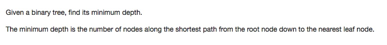

# 110 Balanced Binary Tree
- **Depth-first Search** + Tree 
- **Breath-first Search** + Tree + Queue

## Description


## 1. Thought line
- The minimum depth is the number of nodes along the shortest path from the root node down to the nearest leaf node.

## 2. **Depth-first Search** + Tree

```c
/**
 * Definition for a binary tree node.
 * struct TreeNode {
 *     int val;
 *     TreeNode *left;
 *     TreeNode *right;
 *     TreeNode(int x) : val(x), left(NULL), right(NULL) {}
 * };
 */

class Solution {
private:
    void depthFirstSearchMinDepth(TreeNode* node, int& res, int depOfNode){
        if (node == nullptr) return;
        ++depOfNode;
        if (node->left==nullptr && node->right==nullptr && res>depOfNode) res = depOfNode;
        depthFirstSearchMinDepth(node->left, res, depOfNode);
        depthFirstSearchMinDepth(node->right, res, depOfNode);

    }
public:
    int minDepth(TreeNode* root) {
        if (root == nullptr) return 0;
        int res = INT_MAX;
        depthFirstSearchMinDepth(root, res, 0);
        return res;
    }
}

```

## 3. **Breadth-first Search** + Tree + Queue

```c

```