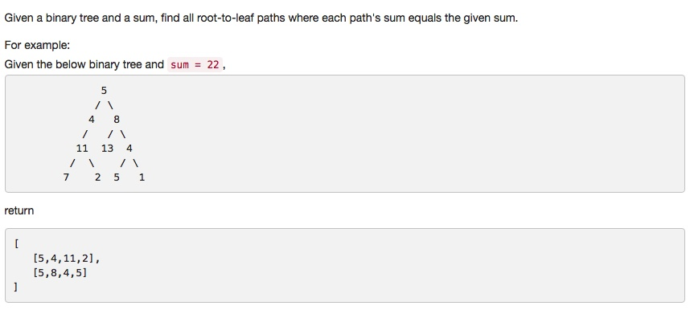

# 113 Path Sum II
- **Depth-first Search** + Tree 


## Description


## 1. Thought line

## 2. **Depth-first Search** + Tree

```c
/**
 * Definition for a binary tree node.
 * struct TreeNode {
 *     int val;
 *     TreeNode *left;
 *     TreeNode *right;
 *     TreeNode(int x) : val(x), left(NULL), right(NULL) {}
 * };
 */
class Solution {
private:
    void dfsSum(vector<vector<int>>& res, vector<int> temp, TreeNode* node, int sum, int tempSum){
        if (node == nullptr) return;
        tempSum += node->val;
        temp.push_back(node->val);
        if (!node->left && !node->right && tempSum == sum){
            res.push_back(temp);
            return;
        }
        dfsSum(res, temp, node->left, sum, tempSum);
        dfsSum(res, temp, node->right, sum, tempSum);
    }
public:
    vector<vector<int>> pathSum(TreeNode* root, int sum) {
        vector<vector<int>> res(0);
        dfsSum(res, {}, root, sum, 0);
        return res;
    }
};
```

```c

```