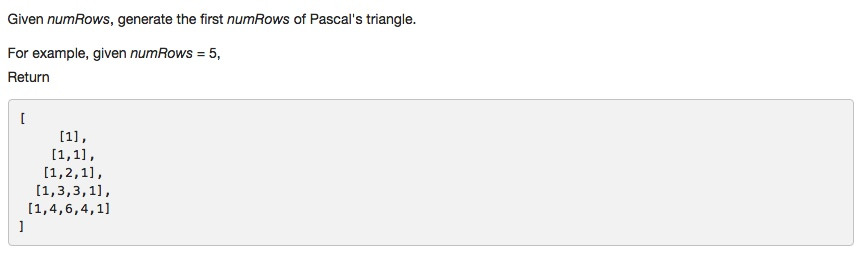
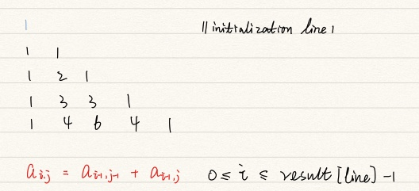

# 118 Pascal's Triangle
- array


## Description


## 1. Thought line



## 2. **Depth-first Search** + Tree

```c
class Solution {
public:
    vector<vector<int>> generate(int numRows) {
        if (numRows==0) return {};
        vector<vector<int>> result(numRows);
        result[0] = {1};
        
        for (int i = 1; i<=numRows-1; ++i){
            for (int j = 0; j<=i; ++j){
                int upLineSize = i; // // [0, upLineSize-1]
                int lfElementUpLine = (i-1>=0 && j-1>=0)? result[i-1][j-1]:0;
                int rtElementUpLine = (i-1>=0 && j<=i-1)? result[i-1][j]:0;
                result[i].push_back(lfElementUpLine+rtElementUpLine);
            }
        }
        return result;
    }
};
```
