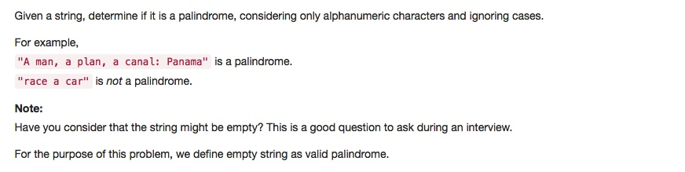

# 125 Valid Palindrome
- **Two pointers** + string
 

## Description

## 1. Thought line


## 2. **Two pointers** + string

```c
class Solution {
public:
    bool isPalindrome(string s) {
        if (s.size()<=1) return true;
        int a = 0, b = s.size()-1;
        
        while (a<b){
            while(!isalnum(s[a]) && a+1<=b)
                ++a;
            while(!isalnum(s[b]) && a<=b-1)
                --b;
            if (tolower(s[a]) == tolower(s[b])){
                ++a, --b;
            }
            else return false;
        }
        return true;
    }
};
```