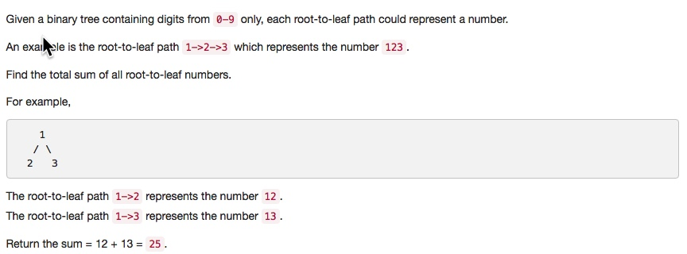

# 129. Sum Root to Leaf Numbers
- **Depth-first Search** + Tree 


## Description


## 1. Thought line

## 2. **Depth-first Search** + Tree

```c
/**
 * Definition for a binary tree node.
 * struct TreeNode {
 *     int val;
 *     TreeNode *left;
 *     TreeNode *right;
 *     TreeNode(int x) : val(x), left(NULL), right(NULL) {}
 * };
 */
class Solution {
private:
    void sumNumbersDSP(TreeNode* node, int preSum, int& result){
        if (node==nullptr) return ;
        if (node->left==nullptr && node->right==nullptr) {
            result += preSum*10 + node->val;
            return;
        }
        sumNumbersDSP(node->left, preSum*10 + node->val, result);
        sumNumbersDSP(node->right, preSum*10 + node->val, result);
    }
public:
    int sumNumbers(TreeNode* root) {
        int result = 0;
        sumNumbersDSP(root, 0, result);
        return result;
    }
};
```