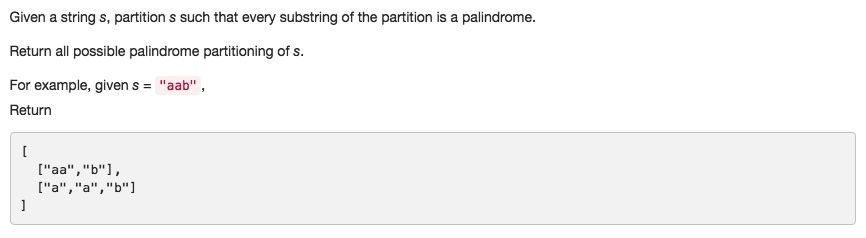

# 131. Palindrome Partitioning
- **BackTracking**

## Description


## 1. Thought line

## 2. **BackTracking**

```c
class Solution {
private:
    bool isPalindrome(string s){
        if (s.empty()) return false;
        int a = 0, b = s.size()-1;
        while (a<=b){
            if (s[a]!=s[b]) return false;
            ++a, --b;
        }
        return true;
    }
    
    void backtrackingPartition(string s, int st, vector<vector<string>>& result, vector<string> tempRes){
        if (st>s.size()-1){
            result.push_back(tempRes);
            return;
        }
        string tempStr = "";
        for (int cutSpot = st; cutSpot<=s.size()-1; ++cutSpot){
            tempStr +=s[cutSpot];
            if (isPalindrome(tempStr)){
                tempRes.push_back(tempStr);
                backtrackingPartition(s, cutSpot+1, result, tempRes);
                tempRes.pop_back();
            }
        }
    }
public:
    vector<vector<string>> partition(string s) {
        vector<vector<string>> result(0);
        vector<string> temp(0);
        if (s.empty()) return result;
        backtrackingPartition(s, 0, result, temp);
        return result;
    }
};
```