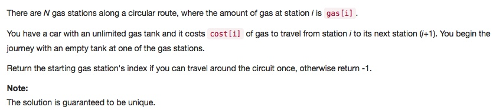
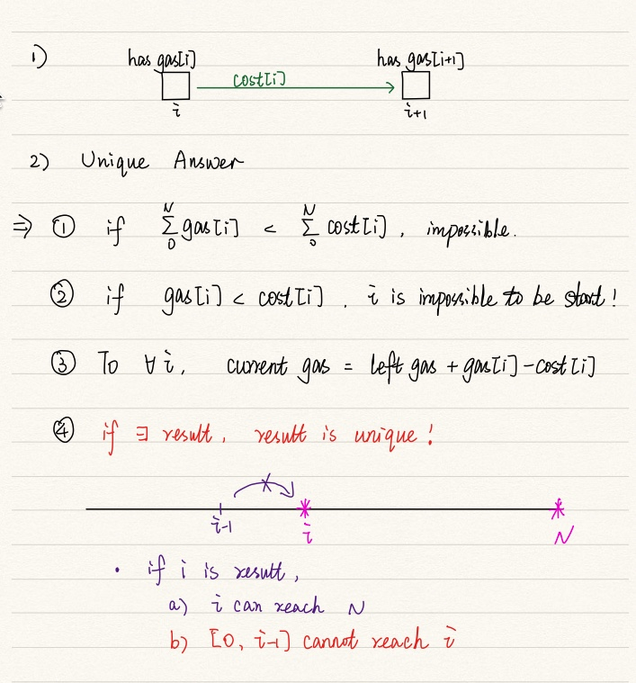

# 134. Gas Station 
- **Greedy**

## Description


## 1. Thought line



## 2. **Greedy**

```c
class Solution {
public:
    int canCompleteCircuit(vector<int>& gas, vector<int>& cost) {
        int candidateRes = 0;
        int curGas = 0, netGas = 0;
        for(int i = 0; i<=gas.size()-1; ++i){
            netGas += gas[i] - cost[i];
            curGas += gas[i] - cost[i];
            if (curGas<0){
                curGas = 0;
                candidateRes = i+1;
            }
        }
        if (netGas<0) return -1;
        return candidateRes;
    }
};
```