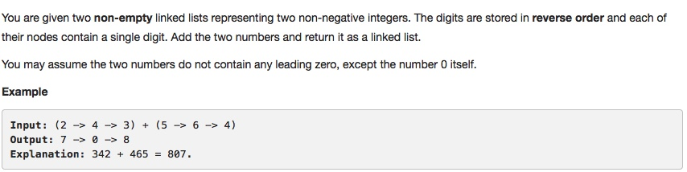

# 002 Add Two Numbers

- **Linked List**+**Math**


## Description



## 1. Thought Line

### (1) Discuss how to reverse a linked list

```c
ListNode* reverseListOrder(ListNode* lst){
	ListNode* dummyHead = new ListNode(0);
	ListNode* dummyTail = nullptr;
	ListNode* insertTo = dummyTail;
	while(lst!=nullptr){
	ListNode* insertNode = new ListNode(lst->val);
	insertNode->next = insertTo;
	dummyHead->next = insertNode;
	insertTo = insertNode;
	lst = lst->next;
	}
	return dummyHead->next;
}
```

### (2) Math logic
- Need to analyze the carry direction.
- in "2 -> 4 -> 3"+"5 -> 6 -> 4", it is from left to right
- in "342"+"465", it is from right to left


## 2. Linked List + Math

```c
/**
 * Definition for singly-linked list.
 * struct ListNode {
 *     int val;
 *     ListNode *next;
 *     ListNode(int x) : val(x), next(NULL) {}
 * };
 */
class Solution {

private:
    ListNode* addList(ListNode* l1, ListNode* l2){
        ListNode* dummyHead = new ListNode(0);
        ListNode* head = dummyHead;
        signed int carry = 0;
        while(l1!=nullptr || l2!=nullptr || carry !=0){
            int l1Val = (l1!=nullptr) ? l1->val : 0;
            int l2Val = (l2!=nullptr) ? l2->val : 0;
            int sumOfl1l2carry = l1Val + l2Val + carry;
            
            head->next = new ListNode (sumOfl1l2carry%10);
            carry = sumOfl1l2carry/10;
            
            l1 = (l1!=nullptr)? l1->next : nullptr;
            l2 = (l2!=nullptr)? l2->next : nullptr;
            head = head->next;
        }
        return dummyHead->next;
    }

public:
    ListNode* addTwoNumbers(ListNode* l1, ListNode* l2) {
        if (l1==nullptr) return l2;
        if (l2==nullptr) return l1;
        ListNode* l1Addl2 = addList(l1,l2);
        return l1Addl2;
    }
};
```

