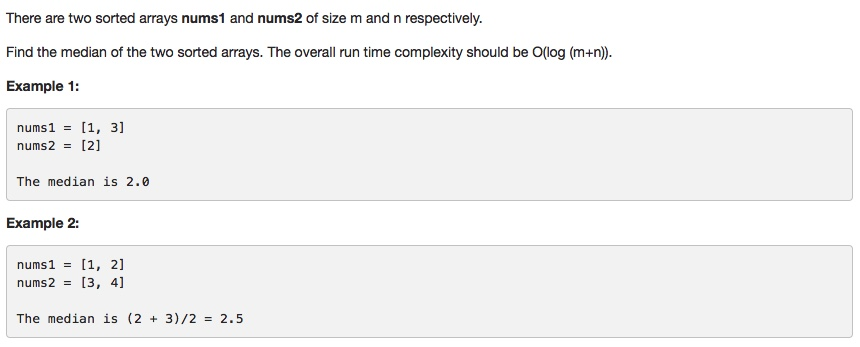

# 004 Median of Two Sorted Arrays

-  **Divide and conquer**
-  **Binary Search**


## Description



## 1. Thought Line
###(1) The basic idea is to always compare the median of A and B and drop half of A or B elements based on the comparison results.

###(2) About median
- When the length is odd, median is num[length/2+1]
- When the length is even, median is (num[length/2+1]+num[length/2])/2


## 2.  Divide-and-Conquer

```c

```

## 3. Binary Search

```c

```