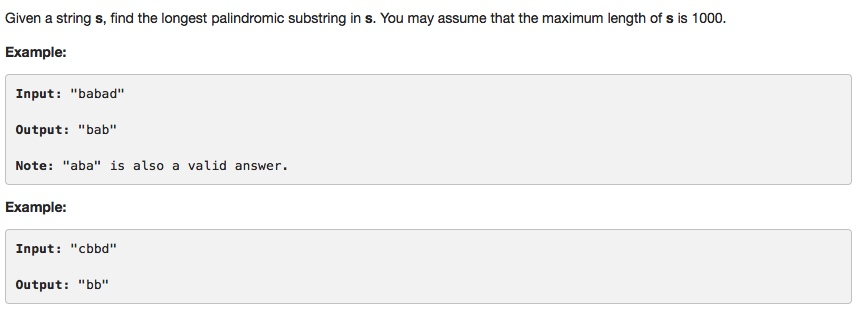

# 005 Longest Palindromic Substring

-  **Dynamic Programming**+string


## Description


## 1. Thought Line
### (1) To each element, set it as the middle elements and check from both left and right direction. 

## 2.  **Dynamic Programming**+string

```c
class Solution {
public:
    string longestPalindrome(string s) {
      int n = s.size();
      int len = 0; //len is the max length of Palindrome string.
      int start = 0; 
      for(int i = 0; i < n; i++){
        
        // start to expend the interval
        int left = i, right = i;
        // consider duplicate characters.
        while(right < n && s[right+1] == s[right]) 
          right++;
        i = right;
        
        // keep expanding
        while(left > 0 && right < n-1 && s[left-1] == s[right+1]){
          left--;
          right++;
        }
        
        //update results
        if(len < right-left+1){
          len = right - left + 1;
          start = left;
        }
      }
      return s.substr(start, len);
    }
};
```

