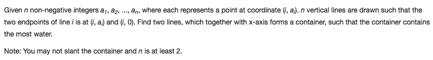

# 011 Container With Most Water

-  **Two Pointer**+Array


## Description


## 1. Thought Line


## 2.  **Two Pointer**+Array

```c
class Solution {
public:
    int maxArea(vector<int>& height) {
      int water = 0;
      int i = 0, j = height.size() - 1;
      while (i < j) {
          int h = min(height[i], height[j]);
          water = max(water, (j - i) * h);
          while (height[i] <= h && i < j) i++;
          while (height[j] <= h && i < j) j--;
      }
      return water;
    }
};
```