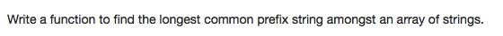

# 014 Longest Common Prefix

-  **string**


## Description


## 1. Thought Line


## 2.  **string**

```c
class Solution {
public:
    string longestCommonPrefix(vector<string>& strs) {
        string prefix = "";
        int idx = 0;
        while(true&&!strs.empty()){
            for(int i=0; i<strs.size(); i++){
                if(idx >= strs[i].size() ||
                   (i > 0 && strs[i][idx] != strs[i-1][idx]))
                  return prefix;
            }
            prefix+=strs[0][idx];
            ++idx;
        }
        return prefix;
    }
};
```

