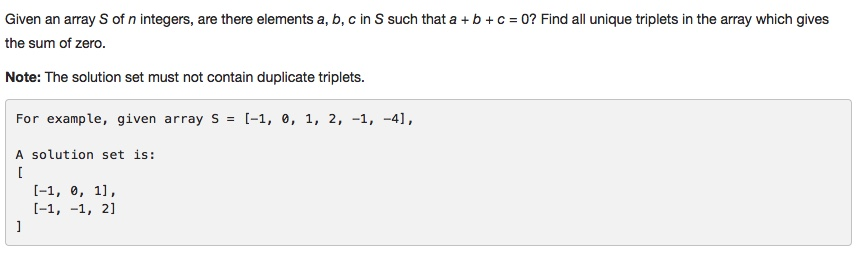

# 015 3Sum

- **Two Pointers**

## Description


## 1. Thought line

## 2. Two Pointers with optimization

```c
class Solution {
public:
    vector<vector<int>> threeSum(vector<int>& nums) {
        vector<vector<int>> result;
        if (nums.size()<3) return result;
        
        int N = nums.size();
        sort(nums.begin(),nums.end());
        
        for (int i=0; i<=N-3; ++i){
            if (i>0 && nums[i]==nums[i-1]) continue;
            if (nums[i]+nums[N-1]+nums[N-2]<0) continue;
            if (nums[i]+nums[i+1]+nums[i+2]>0) break;
            
            int front = i+1, tail = N-1;
            while (front<tail){
                if (nums[i] + nums[front] + nums[tail] == 0) {
                    result.push_back({nums[i], nums[front], nums[tail]});
                    while (front+1 < tail && nums[front] == nums[front+1]) 
                      ++front;
                    while (tail-1 >front && nums[tail] == nums[tail-1]) 
                      --tail;
                    ++front, --tail;
                }else if(nums[i] + nums[front] + nums[tail] < 0) ++front;
                else --tail;
            }
        }
        return result;
    }
};
```

