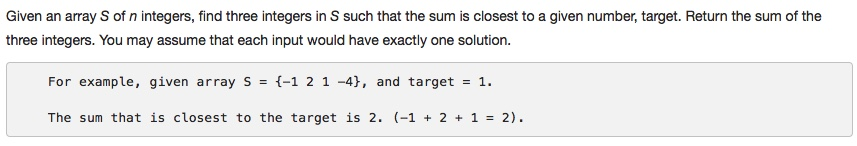

# 016 3Sum Closest

- **Two Pointers**

## Description


## 1. Thought line

## 2. Two Pointers

```c
class Solution {
public:
    int threeSumClosest(vector<int>& nums, int target) {
        
        if (nums.size() < 3) return 0;
        sort(nums.begin(), nums.end());
        int N = nums.size(), sum = 0, dif = INT_MAX;
        for (int i = 0; i <= N-3; ++i){
            if (i > 0 && nums[i-1] == nums[i]) continue;
            int front = i+1, tail = N-1;
            while(front < tail){
                int sum_temp = nums[i] + nums[front] + nums[tail];
                if (sum_temp == target) return target;
                else{
                    if (abs(sum_temp - target)<dif){
                        dif = abs(sum_temp - target);
                        sum = nums[i] + nums[front] + nums[tail];
                    }
                    if(sum_temp<target) {
                        while(front+1 < tail && nums[front+1] == nums[front]) ++front;
                        ++front;
                    }
                    else{
                        while(tail-1 >front && nums[tail-1] == nums[tail]) --tail;
                        --tail;
                    }
                }
            }
        }
        return sum;
    }
};
```

