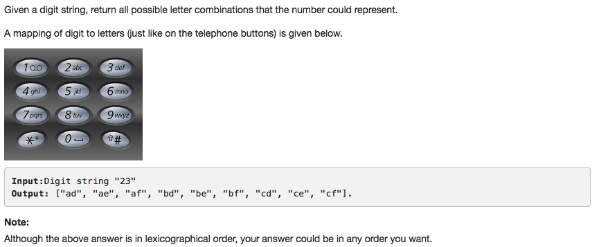

# 017 Letter Combinations of a Phone Number

- **BackTracking**

## Description


## 1. Thought line


## 2. BackTracking

```c
class Solution {
public:
    vector<string> letterCombinations(string digits) {
      vector<string> result;
      if(digits.empty()) return vector<string>();
      static const vector<string> v = {"", "", "abc", "def", "ghi", "jkl", "mno", 
                                       "pqrs", "tuv", "wxyz"};

      result.push_back("");   // add a seed for the initial case
      for(int i = 0 ; i < digits.size(); ++i) {
          int num = digits[i]-'0';
          if(num < 0 || num > 9) break;

          const string& candidate = v[num];
          if(candidate.empty()) continue;

          vector<string> tmp;
          for(int j = 0 ; j < candidate.size() ; ++j) {
              for(int k = 0 ; k < result.size() ; ++k) {
                  tmp.push_back(result[k] + candidate[j]);
              }
          }
          result.swap(tmp);
      }
      return result;
    }
};
```

