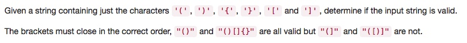

# 020 Valid Parentheses

- **Stack**
- **String**

## Description


## 1. Thought Line
(1) char to string


## 2. Stack

```c
class Solution {
public:
    bool isValid(string s) {
        stack<char> stk;
        for (auto &c:s){
            string temp = ""; // for char to string
            if (!stk.empty() && 
                (temp+stk.top()+c=="()"||temp+stk.top()+c=="{}"||temp+stk.top()+c=="[]"))
                stk.pop();
            else stk.push(c);
        }
        return stk.empty()?true:false;
    }
};
```

