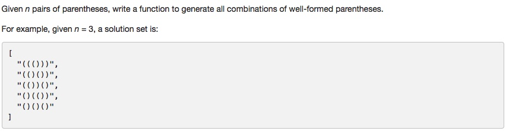

# 021 Merge Two Sorted Lists

- **Backtracking**+string
- 
## Description


## 1. Thought line

## 2. **Backtracking**+string

```c
class Solution {
private:
    void generateParenthesis_fct(int lfCount, int rtCount, int n, string str, vector<string>& result){
        if (lfCount<rtCount || lfCount>n ||rtCount>n || n<=0) return;
        if (lfCount==n && rtCount==n) {
            result.push_back(str);
            return;
        }
        // insert "("
        if (lfCount<n)
            generateParenthesis_fct(lfCount+1, rtCount, n, str+"(", result);
        // insert ")"
        if(lfCount>rtCount)
            generateParenthesis_fct(lfCount, rtCount+1, n, str+")", result);
    }
public:
    vector<string> generateParenthesis(int n) {
        vector<string> result;
        generateParenthesis_fct(0, 0, n, "", result);
        return result;
    }
};
```

