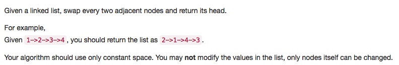

# 024 Swap Nodes in Pairs

- **Linked List**

## Description


## 1. Thought line


## 2. Linked List

```c
/**
 * Definition for singly-linked list.
 * struct ListNode {
 *     int val;
 *     ListNode *next;
 *     ListNode(int x) : val(x), next(NULL) {}
 * };
 */
class Solution {
public:
    ListNode* swapPairs(ListNode* head) {
        ListNode* dummyHead = new ListNode (0);
        dummyHead->next = head;
        ListNode* ptrBeforeOdd = dummyHead;
        ListNode* ptrOdd = dummyHead;
        ListNode* ptrEven = dummyHead;
        while (ptrBeforeOdd !=nullptr){
            // Only when odd and even both exist, continue
            if (ptrOdd->next != nullptr && ptrOdd->next->next !=nullptr){
                ptrOdd = ptrOdd->next;
                ptrEven = ptrOdd->next;
                ptrOdd->next = ptrEven->next;
                ptrEven->next = ptrOdd;
                ptrBeforeOdd->next = ptrEven;
                ptrBeforeOdd = ptrEven = ptrOdd;
            }
            else break;
        }
        return dummyHead->next;
    }
};
```

