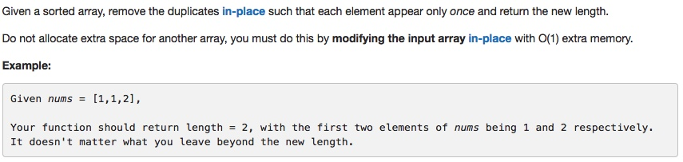

# 026 Remove Duplicates from Sorted Array

- **Two pointers**+array

## Description

## 1. Thought line


## 2. **Two pointers**+array

```c
class Solution {
public:
    int removeDuplicates(vector<int>& nums) {
        
        if (nums.size()<=1) return nums.size();
        
        for (auto st = nums.begin()+1; st != nums.end();){
            if (*st!=*(st-1)) ++st;
            else nums.erase(st);
        }
        return nums.size();
        
    }
};
```

