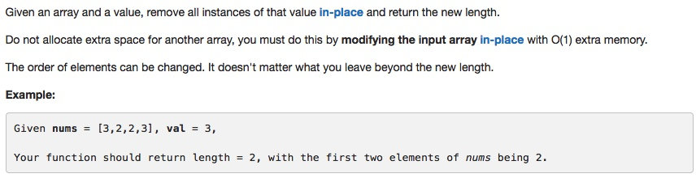

# 027 Remove Element
- **Two pointers**+array

## Description

## 1. Thought line


## 2. **Two pointers**+array

```c
class Solution {
public:
    int removeElement(vector<int>& nums, int val) {
        for (auto st = nums.begin(); st !=nums.end(); ){
            if (*st == val)
                nums.erase(st);
            else ++st;
        }
        return nums.size();
    }
};
```

