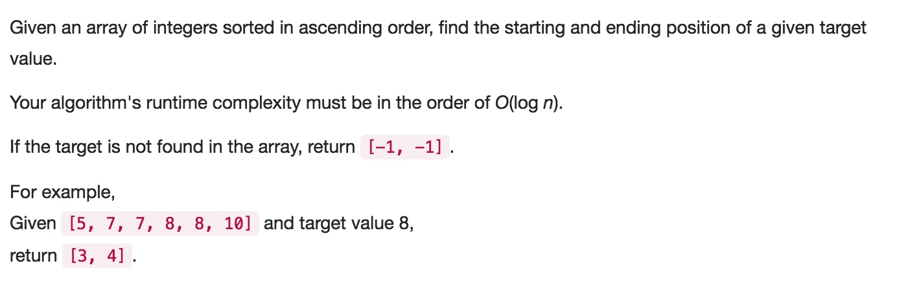

# 034 Search for a Range
- **Binary Search**+array

## Description


## 1. Thought line


## 2. **Binary Search**+array

```c
class Solution {
private:
    void binarySearchRange(vector<int>& nums, int target, int st, int ed, int& indexMin, int& indexMax){
        if (st>ed) return;
        if (target<nums[st] || target>nums[ed]) return;
        if (st==ed && nums[st]!=target) return;
        if (st==ed && nums[st] == target){
            if (indexMin == -1 && indexMax == -1)
                indexMin = indexMax = st;
            else{
                indexMin = st<indexMin?st:indexMin;
                indexMax = st>indexMax?st:indexMax;
            }
        }
        else{
            int mid = (st+ed)/2;
            binarySearchRange(nums, target, st, mid, indexMin, indexMax);
            binarySearchRange(nums, target, mid+1, ed, indexMin, indexMax);
        }
    }
    
public:
    vector<int> searchRange(vector<int>& nums, int target) {
        int indexMin = -1, indexMax = -1;
        binarySearchRange(nums, target, 0, nums.size()-1, indexMin, indexMax);
        return vector<int>{indexMin, indexMax};
    }
};
```

